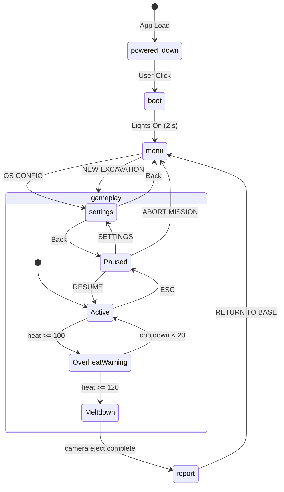

# AGENTS.md — OVERHEAT: Titan Extraction
> **Master agent instructions file.**  
> All agent-specific entry points (`CLAUDE.md`, `.github/copilot-instructions.md`) defer to this document.  
> Read this file in full before reading any code or making any changes.

---

## 1. Quick-start for any agent

```
1. Read this file (AGENTS.md) completely.
2. Read docs/README.md    — overview of the full documentation set by domain.
3. Read docs/HANDOFF.md  — tells you exactly what is done and what is next.
4. Read docs/STANDARDS.md — non-negotiable code, design, and audio rules.
5. If you are editing docs, read docs/AGENTS.md for frontmatter and organization rules.
6. Run:  npm install && npm run build   to verify the tree is healthy before touching anything.
7. Run:  npm run dev                    to preview in-browser.
```

If the build fails, fix it before writing new features.  
Never leave the tree in a failing build state at the end of a session.

---

## 2. Project identity

| Field | Value |
|---|---|
| **Game title** | OVERHEAT: Titan Extraction |
| **Genre** | Extraction / Resource-management / Physics sandbox |
| **Perspective** | True Diegetic 2.5D Cockpit (first-person, UI inside the 3D scene) |
| **Target platform** | Browser (WebGL 2) via Vite + React |
| **Repository** | `arcade-cabinet/overheat-titan-extract` |
| **Working branch** | `copilot/update-game-architecture` |
| **Build command** | `npm run build` |
| **Dev server** | `npm run dev` |

---

## 3. Tech stack (locked — do not change)

| Concern | Library | Why it was chosen |
|---|---|---|
| Rendering | `three` + `@react-three/fiber` | Industry standard R3F |
| Physics | `@react-three/rapier` | Rapier (Rust) — Cannon.js was abandoned after Vec3 NaN crashes with convex hulls |
| State | `zustand` + `persist` middleware | Zero re-render spam; components subscribe to slices only |
| Post-FX | `@react-three/postprocessing` + `postprocessing` | Batches all passes into one shader |
| Helpers | `@react-three/drei` | Cameras, shaderMaterial, Html, Points, Stars |
| Noise | `simplex-noise` | Organic alien terrain; replaces Math.sin grid ripples |
| Particles | `maath` | `maath/random` for Float32Array sphere distributions |
| Animation | `framer-motion` | 2D/menu transitions; 3D motion tooling deferred until a compatible R3F option is selected |
| Audio | Custom `AudioEngine` (Web Audio API) | `tune.js` is not on npm; we replicate its microtonal intent procedurally |

> **Never introduce Cannon.js, React Context for the game loop, or HTML DOM overlays for in-game HUD.**

---

## 4. Repository layout

```
/
├── AGENTS.md                      ← you are here (master instructions)
├── CLAUDE.md                      ← Claude entry point → defers to AGENTS.md
├── README.md
├── .gitignore
├── index.html
├── vite.config.js
├── package.json
│
├── .github/
│   ├── copilot-instructions.md    ← Copilot entry point → defers to AGENTS.md
│   └── pull_request_template.md  ← PR checklist
│
├── docs/
│   ├── README.md                  ← documentation index by domain
│   ├── AGENTS.md                  ← documentation-specific authoring instructions
│   ├── HANDOFF.md                 ← Implementation state + next-steps
│   └── STANDARDS.md               ← All code, design, and audio standards
│   ├── architecture/
│   │   ├── overview.md
│   │   └── runtime-systems.md
│   ├── gameplay/
│   │   └── loop-and-progression.md
│   ├── design/
│   │   └── visual-audio-direction.md
│   ├── lore/
│   │   └── world-primer.md
│   └── operations/
│       └── roadmap.md
│
└── src/
    ├── main.jsx
    ├── App.jsx
    ├── store.js                   ← Zustand store (single source of truth)
    ├── audio/
    │   └── AudioEngine.js         ← Singleton Web Audio engine
    └── components/
        ├── AmbientSpores.jsx
        ├── BootScreen.jsx
        ├── Cockpit.jsx
        ├── Dashboard.jsx          ← CanvasTexture diegetic HUD
        ├── Environment.jsx
        ├── MainMenu.jsx
        ├── MeltdownScreen.jsx
        ├── MoltenSaw.jsx          ← Custom GLSL shaderMaterial
        ├── OreSpawner.jsx
        ├── PauseMenu.jsx
        ├── Player.jsx
        ├── SettingsMenu.jsx
        ├── Silo.jsx
        ├── Terrain.jsx            ← Simplex-noise heightfield + Rapier collider
        ├── UpgradesTerminal.jsx
        └── VisualEffects.jsx      ← Bloom + ChromaticAberration + Vignette
```

---

## 5. Global state machine (Zustand — `src/store.js`)

```
phase values:
  powered_down → boot → menu → gameplay → paused → meltdown → report
                                       ↘ settings (from menu or pause)
```



### Zustand slice summary

| Key | Type | Purpose |
|---|---|---|
| `phase` | string | Game phase enum (see above) |
| `isPaused` | bool | Physics/movement freeze flag |
| `credits` | number | Persisted cross-session currency |
| `rawOre` | number | Current hopper fill (resets on eject) |
| `heat` | number | 0–120; 100 = overheat lockout; 120 = meltdown |
| `isOverheated` | bool | Saw disabled; forced cooling |
| `isMelting` | bool | Terminal state; camera eject active |
| `upgrades` | `{cap,pow,cool}` | Persisted upgrade levels |
| `settings` | `{masterVolume,lookSensitivity,crtOverlays}` | Persisted preferences |
| `sessionCredits` | number | Credits earned this run (for report screen) |

**Computed getters** (call via `get()` inside actions, not as state slices):
- `getMaxOre()` → `100 * upgrades.cap`
- `getGrindDps()` → `50 * (1 + (upgrades.pow - 1) * 0.5)`
- `getCoolingRate()` → `20 * (1 + (upgrades.cool - 1) * 0.5)`

---

## 6. Core gameplay loop

```
1. HARVEST   — Drive mech into cyan ore veins (distance < 5 units).
               Saw auto-spins; rawOre increases at getGrindDps()/s.
               Heat increases at 15 units/s while grinding.

2. RISK      — Heat 0→100: saw works. Heat 100: saw locks, alarm sounds.
               Forced cooling at getCoolingRate()/s until heat < 20.
               Heat 120 (grinding while overheated / isotope collision): MELTDOWN.

3. EJECT     — rawOre >= getMaxOre(): mech ejects a glowing Compressed Cube
               (dynamic RigidBody, type=cuboid).

4. THROW     — Player uses Tractor Beam (pointer-based Spring Joint) to
               grab, drag, reel-in, and throw cube toward Silo.

5. SELL      — Cube enters Silo sensor → audioManager.playSell() → +50 credits.

6. UPGRADE   — Credits spent at Titan OS Terminal (UpgradesTerminal.jsx).
```

---

## 7. Component tree

```mermaid
graph TD
    App --> Canvas[R3F Canvas]
    App --> KeyboardControls
    Canvas --> Suspense
    Suspense --> Scene

    Scene --> Environment
    Scene --> AmbientSpores
    Scene --> Physics[@react-three/rapier Physics]
    Scene --> Cockpit
    Scene --> VisualEffects[EffectComposer]

    Scene --> BootScreen[Html overlay - boot only]
    Scene --> MainMenu[Html overlay - menu only]
    Scene --> PauseMenu[Html overlay - pause only]
    Scene --> SettingsMenu[Html overlay - settings only]
    Scene --> MeltdownScreen[Html overlay - meltdown/report]
    Scene --> UpgradesTerminal[Html overlay - upgrades only]

    Physics --> Terrain[Simplex Heightfield]
    Physics --> Silo[Silo + Sensor]
    Physics --> OreSpawner[Ore Veins + Ejected Cubes]
    Physics --> Player[RigidBody Player]

    Player --> Camera[PerspectiveCamera]
    Cockpit --> Dashboard[CanvasTexture HUD]
    Cockpit --> MoltenSaw[GLSL ShaderMaterial]
```

---

## 8. Physics rules (Rapier — non-negotiable)

- **Player**: dynamic `RigidBody` + `lockRotations` + velocity-driven movement via `setLinvel()` in `useFrame`.
- **Terrain**: `HeightfieldCollider` generated from simplex-noise 64×64 grid, scale=5.
- **Ore veins**: `RigidBody type="fixed"` + `BallCollider`. Never use convex hull on ore.
- **Ejected cubes**: `RigidBody` default (dynamic) + `colliders="cuboid"`.
- **Silo base**: `RigidBody type="fixed"` + hull collider on cylinder mesh.
- **Silo sensor**: `RigidBody type="fixed" sensor` + `CuboidCollider` tall enough to catch arced throws. Uses `onIntersectionEnter`.
- **Tractor Beam anchor**: `RigidBody type="kinematicPosition"` — tracks crosshair 3D position. `useSpringJoint` connects it to grabbed cube.
- **Debris (>20 chunks)**: Use `InstancedRigidBodies` to maintain framerates.

---

## 9. Audio engine contract

`src/audio/AudioEngine.js` exports a singleton `audioManager`. Public API:

| Method | When to call |
|---|---|
| `init()` | Once, on first user gesture (BootScreen click) |
| `setVolume(v)` | Settings change |
| `setPauseFilter(bool)` | ESC to pause/resume — sweeps BiquadFilter 20kHz↔300Hz |
| `playMechStep()` | Each footstep cycle (~0.4s interval) |
| `playGrind(heatPct)` | Every frame while grinding (debounce to 0.1s intervals) |
| `playAlarm()` | On isOverheated transition to true |
| `playSell()` | On cube entering Silo sensor |
| `playPowerUp()` | Boot sequence |
| `playMeltdown()` | Meltdown trigger |
| `playBlip()` | Any UI button interaction |

**Spatial audio (TODO):** Silo hum and dash thrusters should use `THREE.PositionalAudio`. See `docs/HANDOFF.md §4`.

---

## 10. Rendering & post-processing rules

- `EffectComposer disableNormalPass` — always.
- **Bloom**: `luminanceThreshold=0.6`, `mipmapBlur`, `intensity=1.5`, `BlendFunction.ADD`.
- **ChromaticAberration**: offset mapped to `heat`. Only activates past 50% heat. Pulses at 10Hz when `isOverheated`. Ref forwarded as `chromRef` for imperative updates in `useFrame`.
- **Vignette**: `darkness=1.1` normal, `darkness=1.3` when overheated.
- **Grayscale pass** (TODO): Activates during Pause/Diagnostics mode. See `docs/HANDOFF.md §5`.

---

## 11. Session handoff protocol

At the end of every agent session:
1. Update `docs/HANDOFF.md` — mark completed items `[x]`, update "Current known issues".
2. Commit with a descriptive message (no "WIP" — always describe what changed).
3. Run `npm run build` and confirm zero errors before pushing.
4. If a new architectural pattern is established, add it to `docs/STANDARDS.md`.

---

## 12. What NOT to do

- ❌ Do not use `React Context` for game loop state.
- ❌ Do not use Cannon.js.
- ❌ Do not use HTML/CSS overlays for in-game HUD (Dashboard, saw, crosshair must be 3D).
- ❌ Do not use `Math.sin` grids for terrain — use `simplex-noise`.
- ❌ Do not use convex hull colliders on large/complex ore meshes.
- ❌ Do not commit `node_modules/`, `dist/`, or `.env` files.
- ❌ Do not hardcode audio frequencies — route through `AudioEngine` methods.
- ❌ Do not add new state management libraries (Zustand only).
- ❌ Do not mutate Zustand state directly — always use the action methods.
