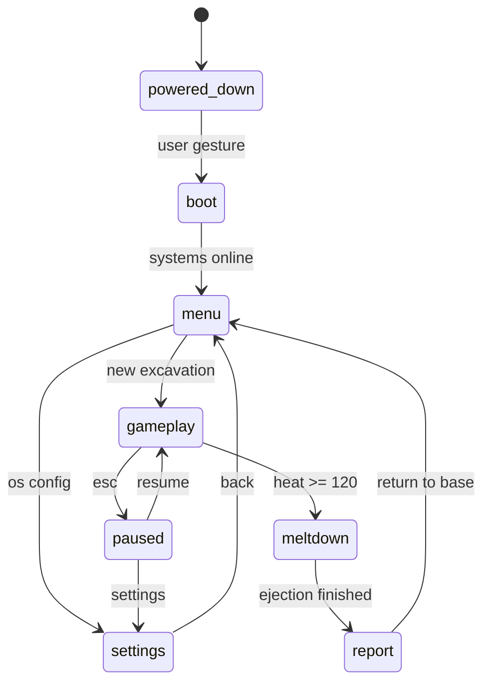
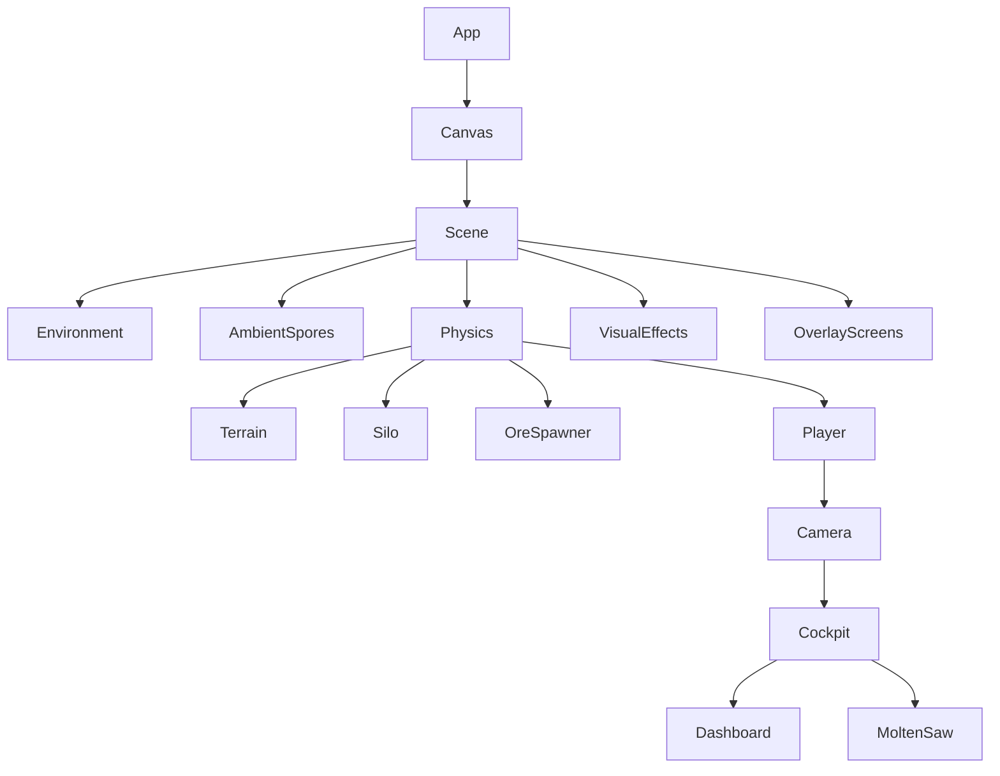

# Architecture Overview

This document captures the top-level shape of the game so a future agent can understand the system before reading component code.

## Product shape

| Axis | Decision |
|---|---|
| Engine model | Browser WebGL game built with Vite + React |
| Scene framework | React Three Fiber |
| Physics | Rapier only |
| State | Zustand single store with persisted slices |
| UI model | Diegetic HUD in 3D, limited Html overlays for menus |
| Presentation | First-person industrial mech cockpit on an alien mining world |

## Phase flow

## Scene composition

## Architectural intent

### 1. Keep the game loop out of React render churn
- Gameplay state lives in `src/store.js`.
- Components subscribe to slices, not the entire store.
- Per-frame movement, shader updates, and camera behavior live in `useFrame`.

### 2. Keep physics stable
- Rapier replaced Cannon.js because the prior prototype hit convex-hull instability and NaN propagation.
- Collider simplicity is a design constraint, not just an optimization.

### 3. Keep the HUD inside the mech
- Dashboard uses a 2D canvas rendered to a `THREE.CanvasTexture`.
- Menus may use `Html`, but the in-run HUD should remain physically mounted in the cockpit.

## Where to go next

- Runtime details: [`runtime-systems.md`](./runtime-systems.md)
- Active implementation status: [`../HANDOFF.md`](../HANDOFF.md)
- Non-negotiable standards: [`../STANDARDS.md`](../STANDARDS.md)
