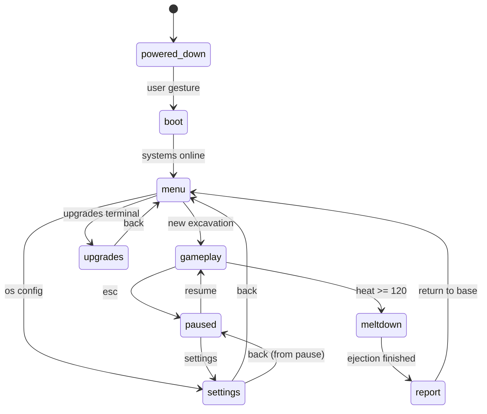
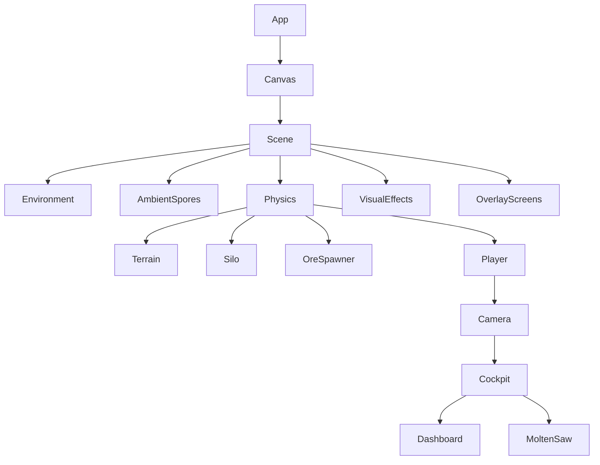

# Architecture Overview

This document captures the top-level shape of the game so a future agent can understand the system before reading component code.

## Product shape

| Axis | Decision |
|---|---|
| Engine model | Browser WebGL game built with Vite + React |
| Scene framework | React Three Fiber |
| Physics | Rapier only (`@react-three/rapier`) |
| State (current) | Zustand single store with persisted slices |
| State (M1+ target) | **Koota ECS** — traits + systems (canonical production target) |
| Tunables (M1+) | **Zod-validated** `src/config.json` — single source of truth for all numeric tunables |
| UI model | Diegetic HUD in 3D (`THREE.CanvasTexture`); `<Html>` overlays for menus only |
| Presentation | First-person industrial mech cockpit on an alien mining world |
| Mobile shell (M3+) | Capacitor (iOS/Android); persistence via capacitor-sqlite / jeep-sqlite + OPFS |

## Architecture decision: Koota ECS + Zod = canonical production target

> **User-confirmed (2026-04-09).** Koota ECS + Zod is the production target for all game simulation state.
> Zustand is **interim** — it handles phase/economy/settings until M1 migration.
> After M1: new gameplay simulation entities (ore nodes, cubes, debris) go in Koota traits, NOT Zustand.
> See `docs/architecture/decisions.md` for the full ADR.

### Why Koota over Zustand for simulation

- **Data-oriented**: ECS separates data (traits/components) from behavior (systems), enabling high-frequency updates without React re-renders.
- **Serialization**: Koota traits map cleanly to JSON for the Zod config pipeline and Capacitor SQLite persistence.
- **Composable systems**: `MovementSystem`, `HeatSystem`, `GrindingSystem`, `EconomySystem`, etc. — each a pure function over world state.

### Zod config pipeline (M1+)

```ts
import { z } from 'zod'

export const GameConfigSchema = z.object({
  mech: z.object({
    baseSpeed: z.number().default(8),
    dashMultiplier: z.number().default(2.5),
    heat: z.object({
      perSecondGrinding: z.number().default(15),
      overheatThreshold: z.number().default(100),
      meltdownThreshold: z.number().default(120),
      cooldownPerSecond: z.number().default(20),
      safeThreshold: z.number().default(20),
    }),
    hopper: z.object({
      baseCapacity: z.number().default(100),
      capacityPerUpgrade: z.number().default(50),
    }),
  }),
  ore: z.object({
    rareSpawnChance: z.number().default(0.15),
    rareHeatMultiplier: z.number().default(3),
    rareTimeMultiplier: z.number().default(3),
  }),
  economy: z.object({
    cubeValue: z.number().default(50),
    rareCubeValue: z.number().default(2500),
    upgradeCosts: z.record(z.string(), z.number()).default({}),
  }),
})

// At startup:
import rawConfig from './config.json'
export const gameConfig = GameConfigSchema.parse(rawConfig)
```

## Koota ECS entity model (M1+ target)

### Traits (data components)

| Trait | Fields | Used by |
|---|---|---|
| `MechStats` | `speed`, `dashMultiplier` | MovementSystem |
| `Heat` | `value: number`, `overheated: boolean` | HeatSystem, AudioSystem, VFXSystem |
| `Hopper` | `current: number`, `max: number` | GrindingSystem, CubeEjectionSystem |
| `Position` | `x, y, z` | All spatial systems |
| `Velocity` | `x, y, z` | MovementSystem |
| `Input` | `move: {x,y}`, `look: {x,y}`, `grind`, `dash`, `tractor` | MovementSystem, GrindingSystem |
| `OreNode` | `health`, `isRare`, `worldPos` | GrindingSystem |
| `Debris` | `type: 'ore'\|'cube'` | PhysicsSync |
| `Cube` | `isRare`, `value` | EconomySystem |
| `AudioEmitter` | `type`, `positional: boolean` | AudioSystem |
| `VFXEmitter` | `type`, `ttl` | VFXSystem |

### Systems (behavior)

- `MovementSystem` — reads `Input`, writes `Velocity`, syncs to Rapier kinematic body
- `HeatSystem` — reads grind state, writes `Heat`, emits `MechOverheated` / `MechRecovered`
- `GrindingSystem` — proximity to `OreNode` → writes `Hopper`, feeds `HeatSystem`
- `CubeEjectionSystem` — hopper full → spawns `Cube` entity with Rapier dynamic body
- `EconomySystem` — `Cube` enters silo sensor → awards credits, emits `CubeSold`
- `AudioSystem` — listens to world events, calls `audioManager` methods
- `VFXSystem` — manages particle/spark emitter TTL and spawn

### R3F binding pattern

R3F components are thin views over Koota entities — they read trait state in `useFrame` and sync to Three.js objects:

```tsx
function MechRig({ entityId }: { entityId: string }) {
  const ref = useRef<THREE.Group>(null!)
  const world = useKootaWorld()

  useFrame(() => {
    const pos = world.getTrait(entityId, 'Position')
    if (!pos) return
    ref.current.position.set(pos.x, pos.y, pos.z)
  })

  return <group ref={ref}><Cockpit entityId={entityId} /></group>
}
```

## Phase flow



## Scene composition



## Production system diagram (M1+ target)

```mermaid
graph TD
    App[Capacitor Shell + React App] --> Canvas[R3F Canvas]
    App --> UI[React DOM UI: Menus, Meta]
    App --> Persistence[SQLite / OPFS Layer]

    Canvas --> ECS[Koota ECS Runtime]
    Canvas --> Physics[@react-three/rapier World]
    Canvas --> Audio[AudioEngine: Web Audio API]

    ECS --> Physics
    ECS --> Audio
    ECS --> R3FBindings[R3F Entity Bindings]

    Persistence --> ECS
    ECS --> Persistence

    UI --> ECS
```

## Architectural intent

### 1. Keep the game loop out of React render churn
- Phase/economy/settings state lives in `src/store.js` (Zustand, current).
- Simulation state lives in Koota traits (M1+, target).
- Components subscribe to slices, not the entire store.
- Per-frame movement, shader updates, and camera behavior live in `useFrame`.

### 2. Keep physics stable
- Rapier replaced Cannon.js because the prior prototype hit convex-hull instability and NaN propagation.
- Collider simplicity is a design constraint: Ball and Cuboid for game objects, Heightfield for terrain.

### 3. Keep the HUD inside the mech
- Dashboard uses a 2D canvas rendered to a `THREE.CanvasTexture`.
- Menus may use `<Html>` (from Drei), but the in-run HUD remains physically mounted in the cockpit.

### 4. All tunables in one place (M1+)
- `src/config.json` validated by Zod at startup.
- No magic numbers in component code — reference `gameConfig.*` only.
- Config changes (for A/B testing in M6) happen in one file.

## Where to go next

- Runtime details: [`runtime-systems.md`](./runtime-systems.md)
- Key decisions: [`decisions.md`](./decisions.md)
- Active implementation status: [`../HANDOFF.md`](../HANDOFF.md)
- Non-negotiable standards: [`../STANDARDS.md`](../STANDARDS.md)
